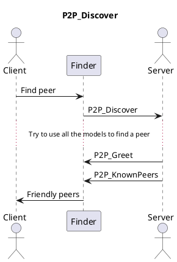

#Protocol SPECS
Any implementation MUST follow this specs.

## P2P Discover

```plantuml
@startuml

title P2P_Discover
actor "Client"
participant Finder
actor "Server"

Client -> Finder : Find peer
Finder -> Server : P2P_Discover
...Try to use all the models to find a peer...
Server -> Finder : P2P_Greet
Server -> Finder : P2P_KnownPeers
Finder -> Client : Friendly peers

@enduml
```

##FAQ
The specification terms:
- Weight
- Peer
- Pool
